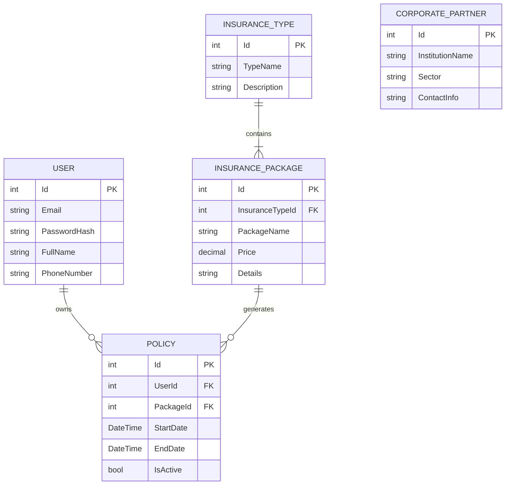

# Safeish - Sigortacılık Yönetim Platformu

## Proje Hakkında
Safeish, kullanıcıların farklı sigorta türlerini inceleyebildiği, bu türlere ait özel paketleri satın alabildiği ve finansal danışmanlık hizmetlerine erişebildiği kapsamlı bir sigortacılık web uygulamasıdır. Proje, modern web standartlarına uygun olarak .NET 10 ve ASP.NET Core MVC mimarisi kullanılarak geliştirilmiştir.

## Temel Özellikler
- **Kullanıcı Kimlik Doğrulama:** Kayıt olma ve giriş yapma işlevleri. E-posta doğrulamalı parola kurtarma akışı.
- **Dinamik Sigorta Paketleri:** Sağlık, Araç vb. çeşitli sigorta türlerinin ve bu türlere ait alt paketlerin dinamik olarak listelenmesi.
- **Modern Tek Sayfa (One-Page) Tasarımı:** Kurumsal güven hissi veren, sigortacılık sektörüne uygun, mobil uyumlu (responsive) UI/UX tasarımı.
- **Etkileşimli Bileşenler:** Kampanya ve sigorta slider'ları, özel marka logosu entegrasyonu ve dinamik başa dön butonu.
- **Genişletilmiş Menü Yapısı:** Ana Sayfa, Sigortalar, Anlaşmalı Kurumlar, Finansal Danışmanlık ve İletişim bölümleri.

## Kullanılan Teknolojiler ve Mimari
- **Framework:** .NET 10.0
- **Mimari:** ASP.NET Core MVC (Model-View-Controller)
- **Veritabanı:** Microsoft SQL Server
- **ORM:** Entity Framework Core (Code-First Yaklaşımı)
- **Kimlik Doğrulama:** ASP.NET Core Identity
- **Front-End:** HTML5, CSS3, Bootstrap 5, JavaScript

### Bağımlılıklar (NuGet Paketleri)
- `Microsoft.EntityFrameworkCore`
- `Microsoft.EntityFrameworkCore.SqlServer`
- `Microsoft.EntityFrameworkCore.Tools`
- `Microsoft.AspNetCore.Identity.EntityFrameworkCore`

## Veritabanı ve ER Diyagramı
Projenin veritabanı yapısı Entity Framework Core Code-First yaklaşımıyla tasarlanmıştır.



## Kurulum ve Çalıştırma

Projeyi yerel ortamınızda çalıştırmak için aşağıdaki adımları izleyebilirsiniz.

1. **Depoyu Klonlayın:**
   ```bash
   git clone https://github.com/baranbilge/safeish-insurance.git
   cd safeish-insurance
   ```

2. **Bağlantı Dizesini (Connection String) Ayarlayın:**
   `appsettings.json` dosyası içerisindeki `DefaultConnection` değerini kendi SQL Server yapılandırmanıza göre güncelleyin:
   ```json
   "ConnectionStrings": {
     "DefaultConnection": "Server=YOUR_SERVER_NAME;Database=SafeishDb;Trusted_Connection=True;MultipleActiveResultSets=true;Encrypt=False"
   }
   ```

3. **Gerekli Paketleri Yükleyin ve Veritabanını Oluşturun:**
   Aşağıdaki komutları kullanarak bağımlılıkları yükleyin ve Code-First migration'larını veritabanına uygulayın:
   ```bash
   dotnet restore
   dotnet ef database update
   ```

4. **Projeyi Başlatın:**
   ```bash
   dotnet run
   ```

## Proje Dizin Yapısı
- `/Controllers`: Uygulamanın yönlendirme ve iş mantığını barındırır (Örn. `HomeController`, `AccountController`).
- `/Models`: Veritabanı tablolarına karşılık gelen C# varlık (entity) sınıflarını ve `SafeishDbContext` sınıfını içerir.
- `/Views`: Kullanıcı arayüzü dosyalarını (`.cshtml`) barındırır.
- `/wwwroot`: Projeye ait CSS, JavaScript, resim ve benzeri statik dosyaları içerir.
